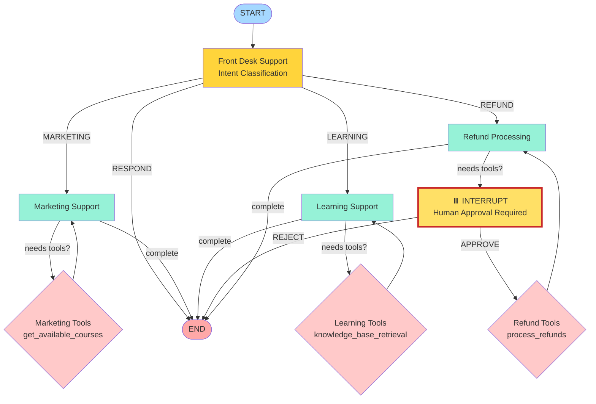

# FinLearn Hub Support Agent

A modular multi-agent support system built with LangGraph that intelligently routes user queries to specialized support agents.

## 🌟 Features

- **Intelligent Routing**: Front desk agent classifies user intent and routes to appropriate team
- **Marketing Support**: Handles promotional queries, offers, and discounts
- **Learning Support**: Assists with course information using RAG-based knowledge retrieval
- **Refund Processing**: Automated refund handling with human-in-the-loop approval
- **Human-in-the-Loop**: Built-in approval system for sensitive operations (refunds, payments, etc.)
- **Tool Integration**: Agents can use tools to fetch real-time information
- **Conversation Memory**: Maintains context across multiple turns
- **Modular Architecture**: Clean separation of concerns for easy maintenance and extension

## 🏗️ Architecture

```
src/
├── agents/                  # Specialized agent implementations
│   ├── frontDeskAgent.ts        # Routes to appropriate team
│   ├── marketingAgent.ts        # Marketing support with promo tools
│   ├── learningAgent.ts         # Learning support with knowledge base
│   └── refundProcessingAgent.ts # Refund processing with HITL
├── routing/                 # Conditional edge functions
│   └── edgeFunctions.ts         # Route logic for the graph
├── utils/                   # Utility functions
│   └── humanApproval.ts         # Human-in-the-loop approval logic
├── graph.ts                # Graph construction and compilation
├── cli.ts                  # Interactive CLI interface
├── state.ts                # State definition
├── model.ts                # LLM configuration
├── tools.ts                # Tool definitions
├── dummyData.ts            # Mock data for development
└── indexDocs.ts            # Document indexing utility
```

## 📊 LangGraph Architecture


<details>
<summary>View as Mermaid Diagram (Click to expand)</summary>



</details>

### Human-in-the-Loop Flow
```
Refund Request
    ↓
Refund Agent analyzes request
    ↓
Agent calls refund tool
    ↓
⏸️  INTERRUPT - Show tool details
    ↓
User Decision:
    ├─→ 1. Approve → Execute tool → Confirm completion
    └─→ 2. Reject  → Cancel operation
```

## 🚀 Quick Start

### Prerequisites

- Node.js (v20.16.0+ recommended)
- npm
- API Keys:
  - Groq API Key (for LLM)
  - OpenAI API Key (for embeddings)
  - Pinecone API Key (for vector store)

### Installation

```bash
# Install dependencies
npm install --legacy-peer-deps

# Set up environment variables
# Create a .env file with:
# GROQ_API_KEY=your_groq_key
# OPENAI_API_KEY=your_openai_key
# PINECONE_API_KEY=your_pinecone_key
# PINECONE_INDEX_NAME=your_index_name
```

### Usage

```bash
# Index documents into vector store (run once)
npm run index-docs

# Run the interactive support agent
npm run dev

# Build TypeScript
npm run build
```

## 🎯 Agent Capabilities

### Front Desk Agent
- Classifies user intent (Marketing, Learning, Refund, or General)
- Routes to specialized teams
- Handles basic conversational queries

### Marketing Agent
- Answers questions about promotions, offers, and discounts
- Uses `getCoursesTool` for promotional information
- Provides concise, friendly responses

### Learning Agent
- Assists with course information and learning paths
- Uses RAG-based retrieval from knowledge base
- Searches indexed documentation for accurate answers

### Refund Processing Agent
- Handles refund requests and policy queries
- Uses `getEmailsTool` to retrieve customer emails
- Uses `refundProcessingTool` to process refunds (requires approval)
- **Human-in-the-Loop**: Waits for user approval before executing refunds
- Provides clear confirmation messages

## 🔧 Tech Stack

- **Framework**: [LangGraph](https://github.com/langchain-ai/langgraph) (LangChain)
- **LLM Provider**: Groq
- **Vector Database**: Pinecone
- **Embeddings**: OpenAI text-embedding-3-small (512 dimensions)
- **Runtime**: Node.js with TypeScript

## 📝 Example Interactions

### Marketing Query
```
You: Hi, do you have any offers going on?
Assistant: Let me check our current offers for you...
Assistant: We have several active promotions:
- EARLY_BIRDS_DISCOUNT: 30% off (valid until Jan 31)
- DIWALI_DISCOUNT: 20% off (valid until Jan 15)
- WINTER25: 25% off (valid until Feb 28)
```

### Learning Query
```
You: What courses do you offer?
Assistant: We offer 5 main courses:
1. Financial Planning Mastery (6 weeks, Beginner-Intermediate)
2. Mutual Fund Investing Essentials (4 weeks, Beginner)
3. Stock Market Foundations (8 weeks, Beginner-Intermediate)
4. Technical Analysis & Trading Strategies (6 weeks, Intermediate-Advanced)
5. Advanced Wealth Management & Portfolio Optimization (10 weeks, Advanced)
```

### Refund Request with Human-in-the-Loop
```
You: I need to process refunds from my inbox
Assistant: Let me check the emails and process refunds...

============================================================
⚠️  SENSITIVE OPERATION - APPROVAL REQUIRED
============================================================

🔧 Tool: refund_processing_tool
📋 Arguments:
   emails:
      1. john.doe@example.com
      2. anita.patel@example.com

============================================================
Options:
  1. Approve - Continue with operation
  2. Reject  - Cancel operation

👤 Your choice (1 or 2): 1

============================================================
✅ APPROVED - Processing refunds...
============================================================